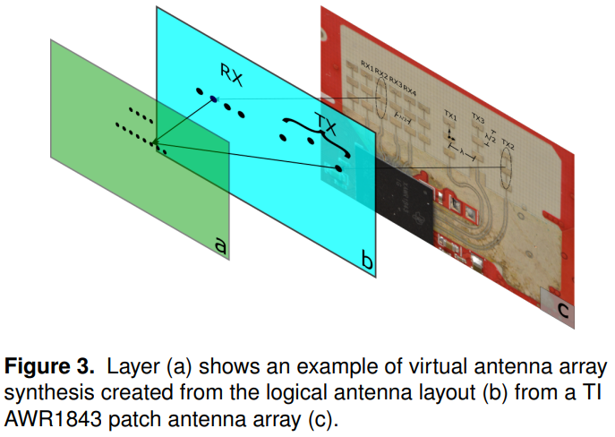

# Coloradar

---
论文： https://arxiv.org/pdf/2103.04510.pdf

数据集地址： https://arpg.github.io/coloradar/

参考代码： https://github.com/azinke/coloradar

参考代码： https://github.com/JzHuai0108/coloradar_tools

---

## 数据集总览

### 毫米波雷达

#### 雷达参数

系统一共包含**两个4D毫米波雷达**：SingleRadar 和 CascadedRadar，收发天线分别为**3x4**以及**12x16**。

### 开发日志
[README](./RadarAlg.md)