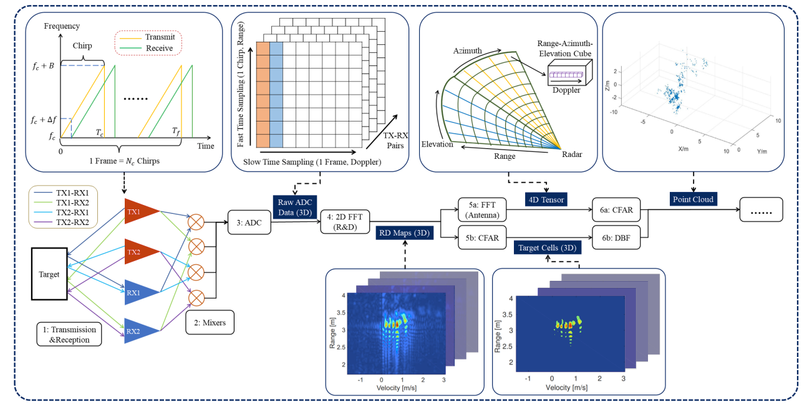

# 毫米波雷达信号处理

## FFT

FFT阶段一般分为两个部分，分别是RangeFFT和DopplerFFT。

由于不可避免的[**泄露**](https://mp.weixin.qq.com/s?__biz=MzI5NTM0MTQwNA==&mid=2247484164&idx=1&sn=fdaf2164306a9ca4166c2aa8713cacc5&scene=21#wechat_redirect)存在，在执行RangeFFT之前，需要对原始采集的adc数据进行[**加窗处理**](https://zhuanlan.zhihu.com/p/24318554)。

在进行完RangeFFT后，得到的结果需要进行**校准**.

### 参考
  
- [何时、何地应用何种的窗函数?](https://mp.weixin.qq.com/s?__biz=MzI5NTM0MTQwNA==&mid=2247484189&idx=1&sn=78af69208296935021da913200ff272d&scene=21#wechat_redirect)
- 

## 相关资料
- [Introduction_Radar_signal_processing](../file/Introduction_Radar_signal_processing.pdf)
  
- [4D Millimeter-Wave Radar in Autonomous Driving: A Survey](../file/2306.04242.pdf)
  
- [Imaging Radar Using Cascaded mmWave Sensor Reference Design](https://www.ti.com/lit/ug/tiduen5a/tiduen5a.pdf)

- [[Youtube:MATLAB]: FMCW Radar for Autonomous Vehicles | Understanding Radar Principles](https://www.youtube.com/watch?v=-N7A5CIi0sg)
  
## 其他参考  
